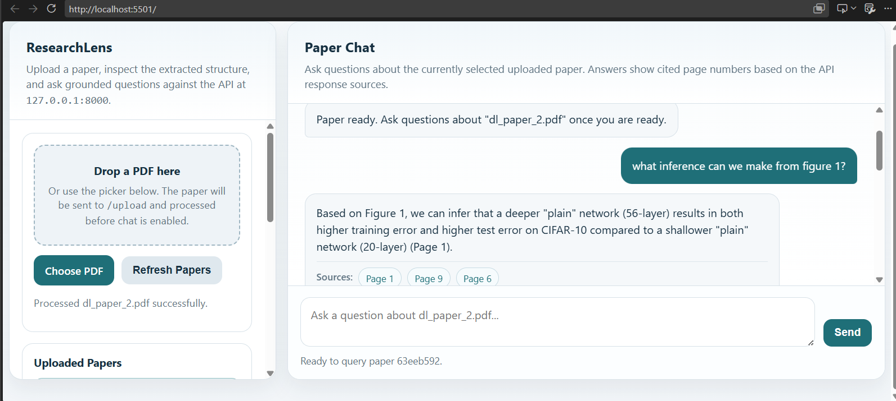
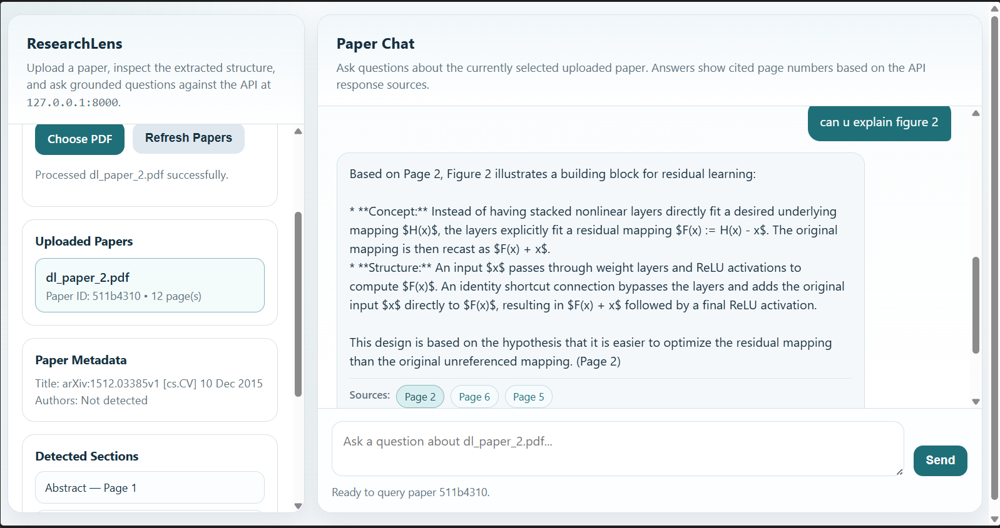
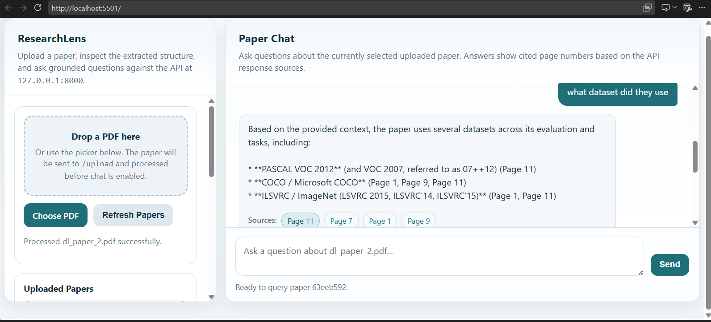

# ResearchLens

### Grounded Question Answering for Research Papers

ResearchLens is an NLP-based research-paper question-answering system that allows users to upload a research paper in PDF format and ask questions about its content in natural language.

Instead of asking a language model to answer directly from its general knowledge, ResearchLens first retrieves relevant evidence from the uploaded paper and then uses Google Gemini to generate a grounded response. The system also provides page-level source information so that answers can be traced back to the original document.

---

## Motivation

Research papers are often long and information-dense. Finding one specific piece of information can require manually searching through several pages.

For example, a researcher may want to quickly know:

- What methodology was used?
- Which dataset was used?
- What evaluation metric was used?
- What optimizer was used?
- What does a particular figure show?
- What is the main conclusion?
- Can I get the abstract directly?

The motivation behind ResearchLens was to explore whether NLP and retrieval-based methods could make this process faster while keeping generated answers grounded in the original research paper.

The project was also developed to understand the complete pipeline behind document-based question answering rather than treating an LLM-based system as a black box.

---

## Key Idea

The central principle of ResearchLens is:

> **Retrieve evidence first, then generate the answer.**

Instead of:

```text
User Question
      ↓
     LLM
      ↓
   Answer
```

ResearchLens follows:

```text
User Question
      ↓
Retrieve relevant evidence
      ↓
Provide evidence to Gemini
      ↓
Generate grounded answer
      ↓
Answer + source information
```

This architecture follows the Retrieval-Augmented Generation (RAG) approach.

---

# Architecture

## Overall Pipeline

```text
                         ┌─────────────────┐
                         │   PDF Upload    │
                         └────────┬────────┘
                                  │
                                  ▼
                    ┌─────────────────────────┐
                    │ Column-Aware PDF        │
                    │ Extraction + Cleaning   │
                    └────────────┬────────────┘
                                 │
                                 ▼
                    ┌─────────────────────────┐
                    │ NLP Preprocessing       │
                    │                         │
                    │ • Sentence Segmentation │
                    │ • Tokenization          │
                    │ • Lemmatization         │
                    │ • NER                   │
                    │ • TF-IDF                │
                    └────────────┬────────────┘
                                 │
                                 ▼
                    ┌─────────────────────────┐
                    │ Sentence-Aware Chunking │
                    └────────────┬────────────┘
                                 │
                                 ▼
                    ┌─────────────────────────┐
                    │ Sentence-BERT           │
                    │ all-MiniLM-L6-v2        │
                    └────────────┬────────────┘
                                 │
                                 ▼
                    ┌─────────────────────────┐
                    │ FAISS Vector Index      │
                    └─────────────────────────┘


                     ┌─────────────────────┐
                     │    USER QUESTION    │
                     └──────────┬──────────┘
                                │
                                ▼
                    ┌─────────────────────────┐
                    │ Query Type Detection    │
                    └────────────┬────────────┘
                                 │
               ┌─────────────────┼──────────────────┐
               │                 │                  │
               ▼                 ▼                  ▼
        Section Request    Figure/Table        General
                           Reference            Question
               │                 │                  │
               ▼                 ▼                  ▼
        Structural Lookup   Lexical +          Semantic
                            Semantic            FAISS
               │                 │                  │
               └─────────────────┼──────────────────┘
                                 │
                                 ▼
                    ┌─────────────────────────┐
                    │  Retrieved Evidence     │
                    └────────────┬────────────┘
                                 │
                                 ▼
                    ┌─────────────────────────┐
                    │       Gemini / RAG      │
                    │    Grounded Generation  │
                    └────────────┬────────────┘
                                 │
                                 ▼
                    ┌─────────────────────────┐
                    │ Answer + Page Citations │
                    └─────────────────────────┘
```

---
# Demo

## ResearchLens Interface



## Figure-Based Question Answering



## Semantic Question Answering




# Processing Pipeline

## 1. PDF Processing

The uploaded PDF is processed using **PyMuPDF**.

The system performs:

- Text extraction
- Text cleaning and normalization
- Line-wrap and hyphenation handling
- Title and author extraction
- Section-heading detection
- Section-text extraction

### Column-Aware Extraction

Academic research papers frequently use two-column layouts.

Raw PDF block ordering can sometimes interleave the left and right columns, producing corrupted text.

This can propagate through the entire pipeline:

```text
Incorrect PDF ordering
        ↓
Corrupted text
        ↓
Incorrect chunks
        ↓
Poor embeddings
        ↓
Poor retrieval
        ↓
Incorrect / irrelevant answers
```

ResearchLens therefore uses the horizontal positions of PDF text blocks to reconstruct column reading order and falls back to normal ordering for single-column documents.

---

# 2. NLP Preprocessing

The extracted text is processed using **spaCy**.

The classical NLP stage includes:

### Sentence Segmentation

The document is divided into sentences so that subsequent chunking can preserve sentence boundaries.

### Tokenization

Text is divided into linguistic units such as words and punctuation.

### Lemmatization

Words are normalized to their base forms.

### Named Entity Recognition

NER identifies entities such as:

- People
- Organizations
- Dates
- Other named entities

These are used as part of the document's NLP analysis and metadata extraction.

### TF-IDF Keyword Extraction

TF-IDF is used to identify important terms within the research paper, such as model names, datasets and other document-specific keywords.

---

# 3. Sentence-Aware Chunking

A research paper may contain thousands of words, so the entire document is not treated as a single retrieval unit.

The document is divided into smaller chunks.

ResearchLens uses **sentence-aware chunking** rather than arbitrary character-level splitting.

The goal is to preserve complete sentences and meaningful context inside each chunk.

This improves the quality of the representations used for retrieval.

---

# 4. Sentence Embeddings

Each text chunk is converted into a dense semantic representation using:

```text
all-MiniLM-L6-v2
```

from the Sentence-Transformers ecosystem.

Embeddings allow text to be compared according to semantic meaning rather than only exact word overlap.

For example:

```text
Question:
"How was the model evaluated?"

Paper text:
"Performance was measured using F1-score and accuracy."
```

The wording is different, but the two pieces of text are semantically related.

---

# 5. FAISS Vector Search

The generated embeddings are stored in a **FAISS** index.

FAISS performs efficient similarity search over the vector representations.

The query is also converted into an embedding.

The system then compares the query vector against the document chunk vectors and retrieves the most relevant passages.

ResearchLens uses normalized embeddings with an inner-product FAISS index, which corresponds to cosine similarity for the normalized vectors.

---

# 6. Priority-Based Hybrid Retrieval

One of the important design decisions in ResearchLens is that **semantic retrieval is not used blindly for every question**.

During testing, we identified specific failure modes where pure semantic retrieval was unreliable.

ResearchLens therefore uses a priority-based retrieval strategy.

```text
                    User Question
                         │
                         ▼
                Query Type Detection
                         │
          ┌──────────────┼──────────────┐
          │              │              │
          ▼              ▼              ▼
       Section?      Figure/Table?    General?
          │              │              │
          ▼              ▼              ▼
      Structural     Lexical +       Semantic
       Lookup        Semantic         FAISS
          │              │              │
          └──────────────┼──────────────┘
                         │
                         ▼
                  Retrieved Context
```

## Priority 1 — Structural Retrieval

For questions such as:

> "Give me the abstract."

semantic search may not reliably identify the correct section because the word **"abstract"** is a section label and does not necessarily occur within the abstract text itself.

ResearchLens therefore detects direct section requests and performs structural lookup.

Example:

```text
"Give me the abstract"
        ↓
Detect section request
        ↓
Locate Abstract section
        ↓
Retrieve section text
```

---

## Priority 2 — Figure/Table Retrieval

For questions such as:

> "What does Figure 1 show?"

the wording of the question may have little lexical overlap with a short figure caption.

ResearchLens detects explicit figure/table references and uses lexical matching to locate the corresponding reference, together with semantic context where appropriate.

Example:

```text
"What does Figure 1 show?"
          ↓
Detect "Figure 1"
          ↓
Find Figure 1 reference
          ↓
Retrieve related content
```

---

## Priority 3 — Semantic Retrieval

For general questions that do not match a structural or explicit figure/table pattern, ResearchLens falls back to semantic FAISS retrieval.

Example:

> "What methodology did the authors use?"

```text
Question
   ↓
Sentence embedding
   ↓
FAISS similarity search
   ↓
Top relevant chunks
```

---

## Why Hybrid Retrieval?

The important principle is:

> **Different query types create different retrieval problems.**

ResearchLens therefore does not treat every question as a generic semantic-search problem.

The current system uses a rule-based priority order:

1. Structural section lookup
2. Figure/table lexical + semantic retrieval
3. Semantic FAISS retrieval

A future version could replace these fixed rules with a learned query-type classifier.

---

# 7. Retrieval-Augmented Generation

After relevant evidence has been retrieved, ResearchLens uses **Retrieval-Augmented Generation (RAG)**.

The retrieved passages are supplied to Google Gemini as context.

Gemini is instructed to answer using the retrieved material rather than relying on unrelated external knowledge.

The process is:

```text
Question
   ↓
Retrieve evidence
   ↓
Construct grounded prompt
   ↓
Gemini
   ↓
Generated answer
```

This separates:

- **Retrieval** — finding evidence from the paper
- **Generation** — expressing that evidence as a natural-language answer

---

# 8. Page-Level Source Information

The system maintains page information associated with document chunks.

Therefore, retrieved evidence can be connected back to the page from which it originated.

This allows users to verify the generated response against the original research paper.

The objective is not simply:

> "Give me an answer."

but:

> **"Give me an answer that I can trace back to the source."**

---

# NLP Techniques Demonstrated

| NLP / AI Technique | Implementation | Purpose |
|---|---|---|
| Text cleaning | `pdf_processor.py` | Normalize PDF extraction artifacts |
| Sentence segmentation | spaCy | Preserve sentence boundaries |
| Tokenization | spaCy | Linguistic preprocessing |
| Lemmatization | spaCy | Normalize word forms |
| Named Entity Recognition | spaCy | Identify entities |
| TF-IDF | scikit-learn | Extract important document-specific terms |
| Structural analysis | PyMuPDF | Detect sections and document structure |
| Sentence embeddings | Sentence-BERT | Represent semantic meaning |
| Vector similarity search | FAISS | Retrieve relevant passages |
| Hybrid retrieval | `qa_engine.py` | Handle different query types |
| RAG | `qa_engine.py` | Ground generation in retrieved evidence |
| LLM generation | Google Gemini | Generate final natural-language answers |

---

# Technology Stack

### Backend

- Python
- FastAPI
- Uvicorn
- Pydantic

### NLP

- spaCy
- scikit-learn
- Sentence-Transformers

### Document Processing

- PyMuPDF

### Retrieval

- FAISS
- Sentence-BERT embeddings

### Generation

- Google Gemini API

### Frontend

- HTML
- CSS
- JavaScript

---

# Project Structure

```text
research_lens/
│
├── app/
│   ├── __init__.py
│   ├── main.py
│   ├── pdf_processor.py
│   ├── nlp_preprocessing.py
│   ├── chunking.py
│   ├── embeddings.py
│   └── qa_engine.py
├── screenshots/
│   ├── researchlens-interface.png
│   ├── figure-question.png
│   └── dataset-question.png
│
├── frontend/
│   └── index.html
│
├── evaluate.py
├── test_api.py
├── make_sample_pdf.py
├── sample_paper.pdf
│
├── requirements.txt
├── .gitignore
├── .env.example
└── README.md
```

---

# API Endpoints

ResearchLens currently exposes the following FastAPI endpoints:

| Endpoint | Method | Purpose |
|---|---|---|
| `/` | GET | API status |
| `/upload` | POST | Upload and process a research paper |
| `/ask` | POST | Ask a question about an uploaded paper |
| `/papers` | GET | List papers currently stored in memory |
| `/status` | GET | Check Gemini availability |

---

# Installation

## 1. Clone the repository

```bash
git clone <YOUR_GITHUB_REPOSITORY_URL>
cd research_lens
```

## 2. Create a virtual environment

### Windows

```cmd
python -m venv .venv
.venv\Scripts\activate
```

### Linux / macOS

```bash
python3 -m venv .venv
source .venv/bin/activate
```

## 3. Install dependencies

```bash
pip install -r requirements.txt
```

## 4. Download the spaCy language model

```bash
python -m spacy download en_core_web_sm
```

---

# Gemini API Configuration

ResearchLens uses the Google Gemini API for answer generation.

The API key should **never be stored directly in the source code or committed to GitHub**.

## Windows

Set the environment variable:

```cmd
setx GEMINI_API_KEY "YOUR_GEMINI_API_KEY"
```

After running `setx`, open a new terminal before starting the application.

## Linux / macOS

```bash
export GEMINI_API_KEY="YOUR_GEMINI_API_KEY"
```

The repository includes `.env.example` as a template:

```env
GEMINI_API_KEY=your_gemini_api_key_here
```

Do not replace the placeholder in `.env.example` with a real key.

---

# Running the Application

Start the FastAPI backend:

```bash
uvicorn app.main:app --reload
```

The API will be available at:

```text
http://localhost:8000
```

Interactive API documentation is available at:

```text
http://localhost:8000/docs
```

The frontend can be opened according to the project's local frontend setup.

---

# Example Questions

After uploading a research paper, ResearchLens can handle different types of questions.

### General semantic questions

```text
What methodology did the authors use?
```

```text
What dataset was used?
```

```text
How was the model evaluated?
```

### Structural questions

```text
Give me the abstract.
```

```text
Give me the methodology section.
```

```text
What is the conclusion?
```

### Figure/Table questions

```text
What does Figure 1 show?
```

```text
What does Table 2 contain?
```

The retrieval strategy is selected according to the type of question.

---

# Evaluation

ResearchLens includes an evaluation script:

```text
evaluate.py
```

The evaluation process sends predefined questions through the live API and checks the returned answers against expected keywords.

The benchmark includes:

- General factual questions
- Structural questions
- Figure/table-related questions
- An intentionally unanswerable question

The unanswerable question is included to test whether the system avoids inventing information that is not supported by the paper.

The evaluation also helped identify retrieval failures that would not have been obvious from informal demonstration alone.

---

# Problems Identified and Solutions

## Problem 1 — Two-Column PDF Extraction

### Observation

When tested on an academic paper with a two-column layout, retrieval quality degraded substantially.

### Root Cause

Raw PDF text blocks were being read according to their internal order rather than the intended visual reading order.

This caused text from the left and right columns to become interleaved.

### Impact

```text
Incorrect extraction
        ↓
Corrupted chunks
        ↓
Incorrect embeddings
        ↓
Poor retrieval
```

### Solution

A column-aware extraction mechanism was implemented using the horizontal positions of PDF text blocks.

The system reads detected columns in the appropriate order and falls back to standard ordering for single-column pages.

---

## Problem 2 — Structural Questions

### Observation

Questions such as:

```text
"Give me the abstract."
```

were not always handled reliably by pure semantic retrieval.

### Reason

The section name "abstract" does not necessarily occur inside the abstract text.

### Solution

Direct section requests are detected and handled using structural section lookup.

---

## Problem 3 — Figure and Table References

### Observation

Questions such as:

```text
"What does Figure 1 show?"
```

can be difficult for pure semantic retrieval because figure captions are often short and may share limited vocabulary with the question.

### Solution

Explicit figure/table references are detected and matched lexically, with semantic retrieval used to provide additional context.

---

# Current Limitations

ResearchLens is currently an academic prototype rather than a production system.

Known limitations include:

- Short, highly specific factual statements can still be missed by retrieval.
- The current query router uses fixed rules rather than a learned classifier.
- Section detection relies partly on document formatting and heuristic cues.
- Papers are currently processed one at a time.
- Paper information is stored in memory rather than persistent storage.
- Multi-paper reasoning is not currently implemented.
- Citation-network analysis is not currently implemented.
- Research-gap detection is not currently implemented.
- Production deployment would require stronger security and configuration.

---

# Future Work

The project is intentionally scoped as a single-paper vertical slice.

Potential future extensions include:

## 1. Query-Adaptive Retrieval

Replace the fixed retrieval rules with a lightweight classifier that predicts the type of query:

```text
Content
Structure
Reference
```

and selects the most appropriate retrieval strategy.

## 2. Improved Retrieval Evaluation

Develop benchmarks specifically targeting short and highly specific factual statements that can be missed by semantic retrieval.

Evaluation could separately measure recall for:

- General questions
- Structural questions
- Figure/table references
- Short factual statements

## 3. Multi-Paper Reasoning

Extend the system from a single paper to a collection of papers.

Potential applications include:

- Cross-paper comparison
- Citation analysis
- Research trends
- Research-gap analysis
- Multi-paper question answering

## 4. Persistent Research Library

Replace the current in-memory storage with persistent storage so that users can maintain a library of research papers.

## 5. Faithful Document Understanding

Extend structure-aware extraction and citation grounding to collections of documents while maintaining traceability between generated answers and their sources.

---

# Research Direction

ResearchLens motivated a broader research interest in **retrieval-augmented and grounded NLP systems for research and knowledge work**.

The project suggests an important design principle:

> Retrieval failures are not necessarily uniform. They can depend on whether a question is asking about document content, document structure, or an explicit reference such as a figure or table.

The current system addresses these cases using rule-based routing.

A longer-term research direction is to investigate whether query-adaptive retrieval can learn these distinctions automatically and generalize beyond research papers to other structured documents such as technical manuals and legal documents.

---

# References

1. Lewis, P., Perez, E., Piktus, A., et al. (2020). **Retrieval-Augmented Generation for Knowledge-Intensive NLP Tasks.** *Advances in Neural Information Processing Systems (NeurIPS)*, 33, 9459–9474.

2. Karpukhin, V., Oguz, B., Min, S., et al. (2020). **Dense Passage Retrieval for Open-Domain Question Answering.** *Proceedings of EMNLP 2020*, 6769–6781.

3. Reimers, N., & Gurevych, I. (2019). **Sentence-BERT: Sentence Embeddings using Siamese BERT-Networks.** *Proceedings of EMNLP-IJCNLP 2019*, 3982–3992.

4. Johnson, J., Douze, M., & Jégou, H. (2017). **Billion-scale similarity search with GPUs.** arXiv:1702.08734.

5. Liu, N. F., Lin, K., Hewitt, J., Paranjape, A., Bevilacqua, M., Petroni, F., & Liang, P. (2024). **Lost in the Middle: How Language Models Use Long Contexts.** *Transactions of the Association for Computational Linguistics*, 12, 157–173.

---

# Scope

ResearchLens was deliberately developed as a focused academic prototype.

The current implementation prioritizes a complete and testable single-paper question-answering pipeline rather than attempting to implement every feature of the original project proposal.

The deferred features include:

- Citation-network analysis
- Multi-paper intelligence
- Research-gap detection
- Research-library trend analysis
- Dashboard and visualization
- Persistent database storage

---

# Author

**Teena Tom**

ResearchLens — NLP Academic Project
